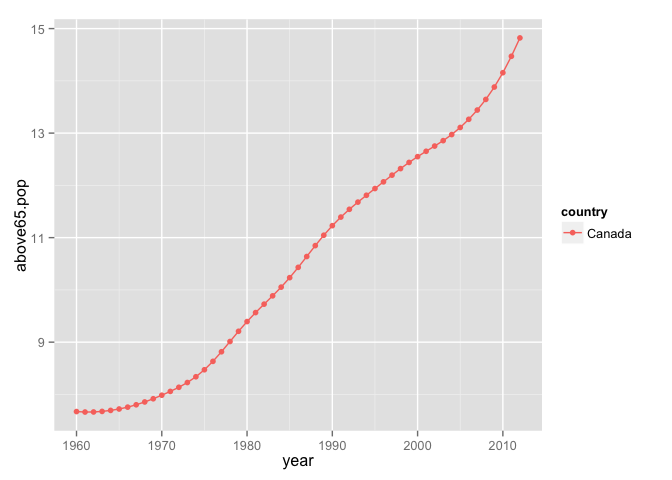

## wbData

Excerpt of the World Bank indicator data on life expectancy, GDP per capita, population, land area, urban population(% of total), population aged 65 and above(% total), fertility rate by country, every year from 1960 to 2012.

### Description
* Source: [World Bank Data](http://data.worldbank.org/)
* 12 variables
- `country`: country name, factoer with 214 levels
- `country.code`: iso-2 code for each country, character
- `isoAlpha`: isoAlpha3 code for each country, character
- `continent`: continent name, factor with 6 levels
- `year`: ranges from 1960 to 2012
- `land.area`: land area, in square kilometers
- `life.exp`: life expectancy at birth, in years
- `fertility.rate`: the number of children that would be born to a woman
- `population`: total population
- `urban.pop`: percentage of urban population of total population
- `above65.pop`: percentage of population aged 65 or above of total population
- `gdp.per.capita`: GDP per capita in US dollars

### Install and test drive

Install `wbData` from Github:


```r
devtools::install_github("JiyingWen/wbData")
```

Load it and test drive with some data aggregation and plotting:


```r
library(wbData)
aggregate(fertility.rate ~ continent, wbData, median)
```

```
##       continent fertility.rate
## 1        Africa         6.2910
## 2          Asia         4.0560
## 3        Europe         1.8800
## 4 North America         3.0750
## 5       Oceania         4.5015
## 6 South America         3.3325
```

```r
suppressPackageStartupMessages(library(dplyr))
wbData %>%
    filter(year == 2012) %>%
    group_by(continent) %>%
    summarise(urban.pop = median(urban.pop))
```

```
## Source: local data frame [7 x 2]
## 
##       continent urban.pop
## 1        Africa   39.8755
## 2          Asia   55.1575
## 3        Europe   69.4520
## 4 North America        NA
## 5       Oceania   56.2180
## 6 South America   76.6095
## 7            NA   31.1890
```

```r
library(ggplot2)
ggplot(subset(wbData, country == "Canada"), aes(x = year, y = urban.pop, color = country)) +
	geom_point(na.rm = TRUE) + geom_line()
```

 

